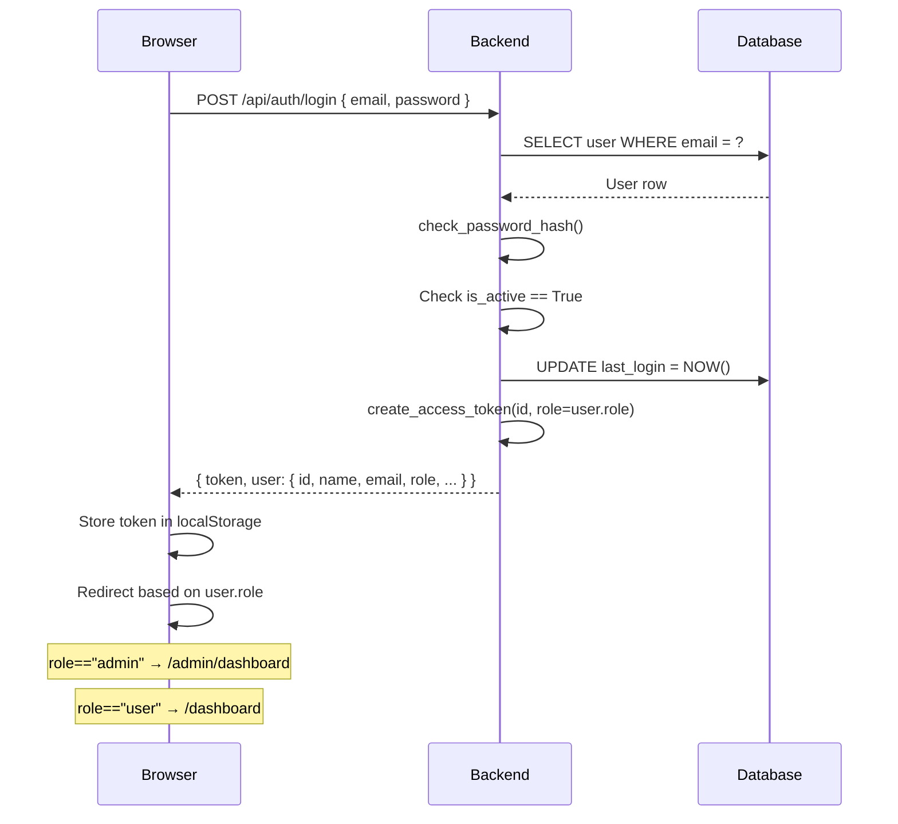
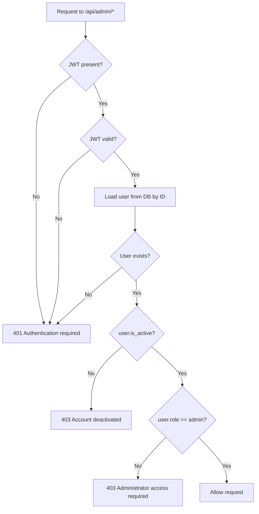

# CyberGuard Admin Panel

Comprehensive documentation for the CyberGuard Admin Panel implementation.

---

## Table of Contents

1. [Architecture Overview](#1-architecture-overview)
2. [Authentication Flow](#2-authentication-flow)
3. [Authorization Flow](#3-authorization-flow)
4. [Database Changes](#4-database-changes)
5. [Backend API Endpoints](#5-backend-api-endpoints)
6. [Frontend Routes](#6-frontend-routes)
7. [Creating the Development Admin Account](#7-creating-the-development-admin-account)
8. [Security Considerations](#8-security-considerations)

---

## 1. Architecture Overview

```
frontend/src/
├── components/
│   ├── AdminLayout.jsx       ← Shared admin page shell
│   ├── AdminRoute.jsx        ← Frontend admin route guard
│   ├── AdminSidebar.jsx      ← Admin navigation sidebar
│   └── ConfirmModal.jsx      ← Destructive-action confirmation dialog
├── pages/
│   ├── AdminDashboard.jsx    ← Stats + Recharts visualisations
│   ├── AdminUsers.jsx        ← User table with search/filter/sort
│   ├── AdminUserDetails.jsx  ← User detail, activity, role editor
│   ├── AdminScans.jsx        ← All-users scan monitoring
│   ├── AdminFindings.jsx     ← All-users findings monitoring
│   ├── AdminSettings.jsx     ← Admin settings page
│   └── Unauthorized.jsx      ← 403 page for non-admins
└── services/
    └── adminService.js       ← Typed API calls for /api/admin/*

backend/app/
├── middleware/
│   └── auth.py               ← @admin_required decorator
├── routes/
│   └── admin.py              ← /api/admin/* blueprint
└── services/
    └── admin_service.py      ← Business logic (no raw SQL)
```

---

## 2. Authentication Flow



---

## 3. Authorization Flow



> **Key principle:** The role is verified from the **database** on every request, not from the JWT claim alone. A role change takes effect immediately.

---

## 4. Database Changes

The `users` table gained four new columns. The migration is safe and idempotent:

| Column | Type | Default | Purpose |
|--------|------|---------|---------|
| `role` | TEXT | `'user'` | `'user'` or `'admin'` |
| `is_active` | INTEGER (bool) | `1` (True) | Account active flag |
| `updated_at` | DATETIME | NOW | Last record modification |
| `last_login` | DATETIME | NULL | Timestamp of last login |

### Running the migration

```bash
cd backend
python migrate_db.py
```

The script uses `ALTER TABLE … ADD COLUMN` and skips columns that already exist. Existing user records are preserved; new columns default to `role='user'` and `is_active=1`.

---

## 5. Backend API Endpoints

All `/api/admin/*` endpoints require:
- Valid JWT (`Authorization: Bearer <token>`)
- User role = `"admin"` (verified in database, not just token)
- User `is_active = True`

Non-admins receive **HTTP 403 Forbidden**.

| Method | Path | Description |
|--------|------|-------------|
| `GET` | `/api/admin/dashboard` | Platform statistics |
| `GET` | `/api/admin/dashboard/charts` | Chart data (time series, severity counts) |
| `GET` | `/api/admin/users` | Paginated user list (search, filter, sort) |
| `GET` | `/api/admin/users/<id>` | Single user detail |
| `GET` | `/api/admin/users/<id>/activity` | User scan/finding activity |
| `PUT` | `/api/admin/users/<id>` | Update user name/email/role |
| `PATCH` | `/api/admin/users/<id>/status` | Activate / deactivate account |
| `DELETE` | `/api/admin/users/<id>` | Delete user (self-delete blocked) |
| `GET` | `/api/admin/scans` | All scans with optional filters |
| `GET` | `/api/admin/findings` | All findings with optional filters |

### Query parameters

**GET /api/admin/users**
- `search` — substring match on name or email
- `role` — `user` or `admin`
- `is_active` — `true` or `false`
- `sort_by` — `name`, `created_at`, `last_login`, `email`
- `order` — `asc` or `desc`
- `page`, `per_page`

**GET /api/admin/scans**
- `user_id`, `risk_level`, `date_from`, `date_to`, `page`, `per_page`

**GET /api/admin/findings**
- `severity`, `user_id`, `page`, `per_page`

### Response: safe fields only

API responses **never** include: `password`, `password_hash`, JWT tokens, or secrets.

Example `GET /api/admin/dashboard`:
```json
{
  "total_users": 42,
  "active_users": 39,
  "inactive_users": 3,
  "total_scans": 180,
  "total_findings": 520,
  "high_risk_scans": 12,
  "critical_findings": 8
}
```

---

## 6. Frontend Routes

| Path | Component | Guard |
|------|-----------|-------|
| `/admin` | → redirect | AdminRoute |
| `/admin/dashboard` | AdminDashboard | AdminRoute |
| `/admin/users` | AdminUsers | AdminRoute |
| `/admin/users/:id` | AdminUserDetails | AdminRoute |
| `/admin/scans` | AdminScans | AdminRoute |
| `/admin/findings` | AdminFindings | AdminRoute |
| `/admin/settings` | AdminSettings | AdminRoute |
| `/unauthorized` | Unauthorized | Public |

`AdminRoute` checks both `isAuthenticated` and `isAdmin` (derived from `user.role` returned by the backend). Non-admins are redirected to `/unauthorized`.

> **Security note:** Frontend route guards are for UX only. The backend enforces authorization independently on every API call.

---

## 7. Creating the Development Admin Account

Admin accounts are **never** created through the public registration form. Use the provided seed script.

### Step 1 — Configure credentials

Edit `backend/.env` (never commit this file):

```env
ADMIN_EMAIL=admin@yourcompany.com
ADMIN_PASSWORD=StrongPassword123!
ADMIN_NAME=Platform Admin
```

### Step 2 — Run the seed script

```bash
cd backend
python seed_admin.py
```

The script:
- Creates a new admin if `ADMIN_EMAIL` doesn't exist.
- Upgrades an existing user with that email to `role="admin"` if they are not already an admin.
- Is idempotent: safe to run multiple times.

### Step 3 — Verify

Log in at `/login` with the admin credentials. You will be redirected to `/admin/dashboard`.

---

## 8. Security Considerations

| Concern | Mitigation |
|---------|------------|
| Privilege escalation | Role verified from DB on every admin request, not from JWT claim |
| IDOR | User ownership checked in scan/finding queries; admins access all |
| SQL injection | All queries use SQLAlchemy ORM, no raw SQL |
| Password exposure | `password_hash` excluded from all `to_dict()` serialisations and API responses |
| Self-deletion/deactivation | Backend blocks admin from deleting or deactivating their own account |
| Token replay | Tokens expire after 8 hours; secrets stored in `.env` only |
| XSS | User-controlled data rendered as text nodes via React (no `dangerouslySetInnerHTML`) |
| Inactive user access | Blocked at login and on every `/api/auth/me` call |
| Admin registration | Public registration always sets `role="user"`; admins created only via `seed_admin.py` |
| Secret exposure | `.env` in `.gitignore`; `.env.example` contains only placeholders |
